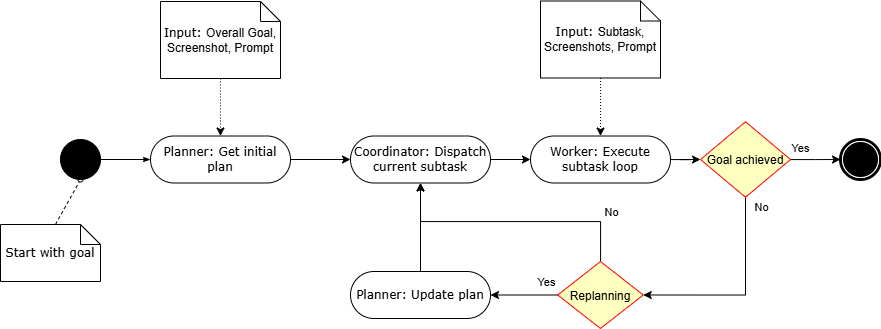
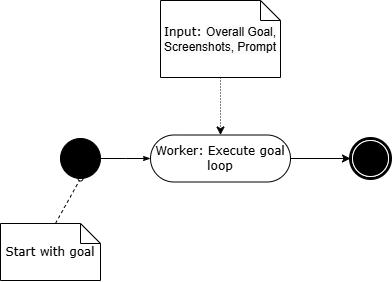
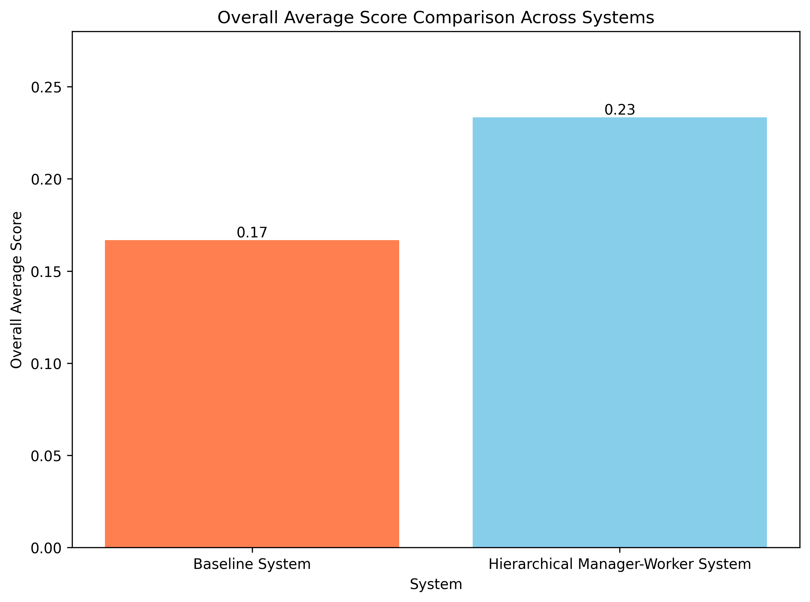
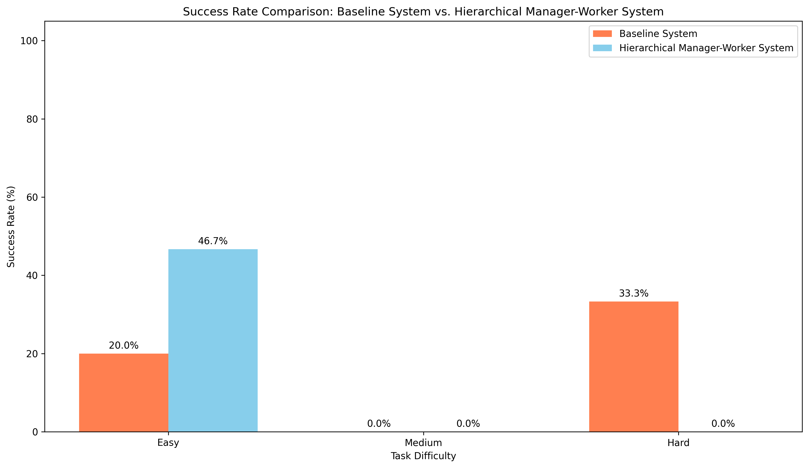
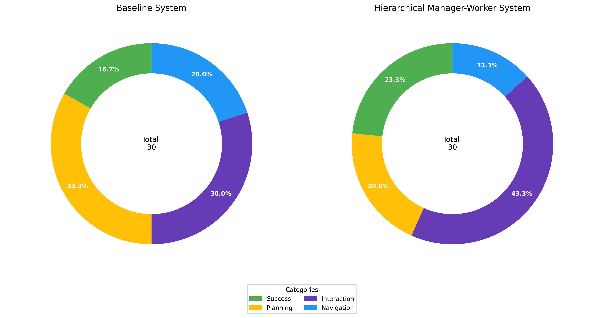

# Towards Agentic LLM frameworks for automating GUI-Tasks: Comparing a single LLM to an Agentic Architecture

This repository contains the source code and experimental results for the bachelor thesis titled "Towards Agentic LLM frameworks for automating GUI-Tasks: Comparing a single LLM to an Agentic Architecture" by Frederik Bauer, submitted to the Vienna University of Economics and Business.

A test notebook for automating tasks on your own device can be found here: https://github.com/Fredibau/agenticLlmFrameworksForAutomatingGuiTasks/blob/main/ClientAgenticArchitecture/test/testnotebook.ipynb.

## Abstract

This thesis investigates whether a hierarchical agent architecture can improve Graphical User Interface (GUI) automation. We compared a manager-worker system, using GPT-4o for high-level planning and the UI-TARS model for low-level execution, against a baseline where UI-TARS operated as a single end-to-end agent. Both systems were evaluated on a set of tasks from the OS-World benchmark, measuring Task Success Rate (TSR) and analyzing failure modes.

The hierarchical system achieved a modestly higher overall TSR (23.3% vs. 16.7%), demonstrating a clear advantage on simple, structured tasks. However, this advantage disappeared with increasing complexity; both systems failed all 'Medium' difficulty web-based tasks, and the monolithic baseline performed better on 'Hard' tasks. Qualitative analysis revealed that even with correct high-level plans, the worker agent consistently failed at fundamental UI interactions like handling web forms and pop-ups.

We conclude that while architectural improvements in planning offer some benefits, they are ultimately undermined by persistent failures in low-level action execution. Robust GUI automation requires foundational improvements in the agent’s core interaction capabilities, highlighting that reliable execution is a prerequisite for high-level strategies to be effective.

## System Architectures

Two primary architectures were implemented and compared in this study.

### 1. Hierarchical Manager-Worker System

This system distributes the cognitive load between a high-level planner and a low-level executor.

* **Manager (Planner):** `GPT-4o` is used to decompose a high-level user goal into a sequence of simpler, actionable steps.
* **Worker (Executor):** `UI-TARS-7B-DPO` receives one low-level instruction at a time from the manager and is responsible for the direct interaction with the GUI (e.g., clicks, typing).

*Figure 1: Hierarchical Manager-Worker Architecture*

### 2. Baseline System

This system uses a single, end-to-end agent to interpret the high-level task and perform all actions.

* **Agent:** `UI-TARS-7B-DPO` is given the main objective and is responsible for planning and executing the entire task sequence on its own.

*Figure 2: Baseline Architecture*

## Methodology

### Experimental Environment

* **Benchmark:** [OSWorld](https://os-world.github.io/), a realistic, execution-based benchmark for evaluating agents on real-world computer tasks.
* **Domain:** All tasks were selected from the `Chrome` domain on an `Ubuntu` virtual machine.
* **Task Set:** A curated set of 10 tasks with varying difficulty levels (Easy, Medium, Hard). A full list of tasks can be found in the thesis appendix.

### Evaluation

* **Quantitative Metric:** Task Success Rate (TSR), determined by OSWorld's automated validation scripts.
* **Qualitative Analysis:** A manual review of interaction logs to categorize failures into `Planning`, `Interaction`, and `Navigation` errors.

## Results

Each of the 10 tasks was run three times for both systems (30 attempts per system).

### Overall Performance

The hierarchical system showed a modest improvement in the overall success rate.

*Figure 3: Overall Average Score Comparison*

### Performance by Task Difficulty

The advantage of the hierarchical system was most pronounced on 'Easy' tasks. Both systems struggled significantly with web-based tasks of 'Medium' difficulty, and the Baseline system surprisingly outperformed the Hierarchical one on 'Hard' tasks.

*Figure 4: Success Rate Comparison by Difficulty*

### Failure Analysis

The analysis of unsuccessful runs revealed distinct failure patterns for each system.

* **Baseline System:** Prone to catastrophic planning failures, context loss, and getting stuck in illogical loops.
* **Hierarchical System:** Failures were more often caused by either a flawed high-level plan from the manager or, more critically, the worker's inability to execute a correct instruction. The overhead of coordination could also be detrimental.

*Figure 5: Task Outcome Distribution by System*

